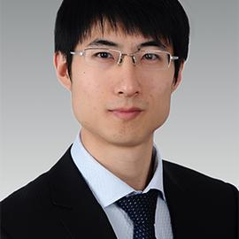

# Chao Zhang: Relieving the Water Stress of Thermoelectric Power Generation in China

Climate New Research

Climate and Water

Understanding the spatial and temporal evolution of thermoelectric water use and water stress

Author

Climate Guest Speakers

Published

August 3, 2018

## Title

Chao Zhang: Relieving the Water Stress of Thermoelectric Power Generation in China

### Time

August 3, 2018

10:30AM - 11:30AM ET

### Venue

1441 Old Computer Science

Stony Brook University

## About

As energy and water are fundamentally intertwined, understanding the spatial and temporal evolution of thermoelectric water use and water stress is important for both sustainable energy development and water resource management. Here we compile high-resolution time-series (2000–2015) of water withdrawal and consumption inventories for China’s thermoelectric power sector to identify the driving forces behind changing water use patterns, and reveal the spatial distribution of thermoelectric water stress. We show that freshwater withdrawal has been decoupled from thermoelectric power generation growth at the national level due to the increased adoption of air-cooling and seawater-cooling technologies and advanced large generating units as well as water use efficiency improvements in this period. Nevertheless, the construction of large coal-fired power generation hubs has increased water stress in many arid and water-scarce catchments in northwestern regions of China. The westward development of the power industry necessitates water-withdrawal caps and the integration of water risk analysis into energy planning.

## Speaker

##### Dr. Chao Zhang

Associate Professor, Tongji University

### Bio

Dr. Chao Zhang is an associate professor in the Department of Public Administration, School of Economics and Management at Tongji University, and an adjunct professor in UN Environment-Tongji Institute of Environment for Sustainable Development. He earned a Ph.D. from School of Environment, Tsinghua University, and finished his postdoctoral research in the Kennedy School of Government, Harvard University. His main research fields are industrial ecology and ecological economics. He is interested in interdisciplinary studies on a wide spectrum of environment, energy and water resources problems, especially sustainable management of energy-water nexus, socioeconomic metabolism analysis, and resource efficiency.

## Readings

- Zhang, Chao, Lijin Zhong, and Jiao Wang. 2018. “Decoupling between Water Use and Thermoelectric Power Generation Growth in China.” *Nature Energy* 3 (9): 792–99. <https://doi.org/10.1038/s41560-018-0236-7>.
