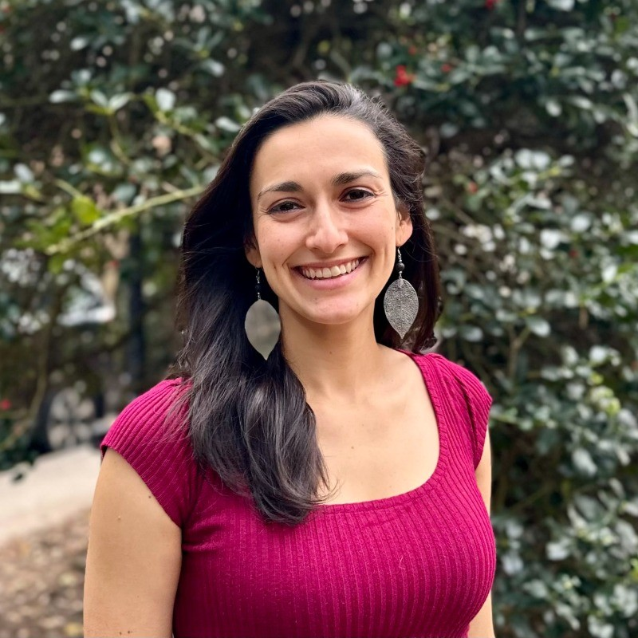

# Claudia Villar-Leeman: NYC’s Electricity Grid and Role of Energy Storage

Climate and Energy

Climate and Industry

NYC’s electricity grid and role of energy storage

Author

Climate Guest Speakers

Published

November 17, 2025

## Title

Claudia Villar-Leeman: NYC’s Electricity Grid and Role of Energy Storage

### Time

November 17, 2025

6:00PM - 7:00PM ET

### Venue

Online via Zoom. Please [register](https://baruch.zoom.us/meeting/register/ZvRnp4MmTHSyn4DRzAr3sw) to participate.

## About

As both New York City and New York State pursue ambitious climate and energy goals, understanding the complexities of the city’s electricity infrastructure has become increasingly critical. The NYC electricity grid operates within a unique regulatory framework that shapes how energy is generated, distributed, stored, and consumed across the five boroughs. With energy storage emerging as a key technology for integrating renewable energy, improving affordability, and enhancing grid resilience, its deployment will play a pivotal role in our collective transition to a cleaner energy future. Claudia will discuss the role of clean electricity in the energy transition, the history and operation of the NYC electricity grid, the electricity regulatory landscape, and the strategic role of energy storage technologies to support New York’s pathway toward achieving a reliable, affordable, and sustainable electricity grid.

## Speaker

##### Claudia Villar-Leeman

Sr. Director of Policy and Regulatory Affairs, New York Battery and Energy Storage Technology Consortium

### Bio

Claudia Villar-Leeman is the Senior Director of Policy and Regulatory Affairs at the New York Battery and Energy Storage Technology Consortium (NY-BEST), where she works to advance market rules, incentive programs, permitting processes, and legislation that will support rapid deployment of energy storage in New York. A New York City native, she brings a deep knowledge of New York’s energy landscape and a commitment to advancing equitable deployment of energy storage and other clean energy technologies. Claudia previously served as an Energy Policy Advisor at the NYC Mayor’s Office of Climate and Environmental Justice, where she led the development of the Office’s long-term energy plan as well as its energy storage portfolio. Claudia holds an M.A. in Climate & Society from Columbia University and a B.A. in Biology from Bowdoin College. She loves spending time outdoors and in 2023 backpacked all 2,200 miles of the Appalachian Trail.

## Readings

Mayor’s Office of Climate and Environmental Justice, [PowerUp NYC: Planning for a clean, resilient, and equitable energy future](https://www.nyc.gov/content/climate/pages/reports-and-publications/powerup-nyc).
