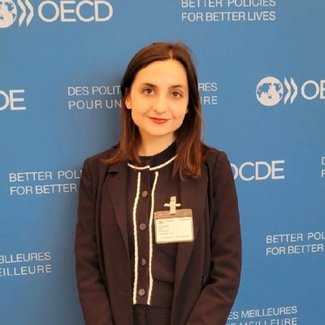

# Ines Benachir: Life Cycle Analysis and Ecodesign of PV Panels

Climate and Environment

Climate and Energy

Climate and Sustainability

Author

Climate Guest Speakers

Published

April 28, 2025

## Title

Life Cycle Analysis and Ecodesign of PV Panels

### Time

Monday, April 28, 2025

3:00 PM - 4:00 PM ET / 9:00 PM - 10:00 PM CET (Please note this is a different time than our normal class schedule)

### Venue

Online via Zoom.

Please [register](https://forms.gle/65hnhJPmnYaz5utG9) to participate.

## About

The presentation first offers an overview of photovoltaic (PV) systems and tracing their life cycle from raw material extraction to end-of-life disposal or recycling. It highlights essential criteria for selecting PV panels, including efficiency, durability, and environmental impact. The role of EU regulations, such as the Ecodesign and WEEE Directives, is discussed in shaping sustainability across the sector. Key standards and guidelines that structure the EU market are also reviewed. The talk explores important considerations for conducting life cycle assessments (LCAs) and outlines challenges in comparing LCA results due to data quality and differing assumptions. It concludes with ongoing efforts to harmonize sustainability assessments and strengthen ecodesign criteria, aiming to support a more circular and environmentally responsible PV industry in Europe.

## Speaker

##### Ines Benachir

ESG Manager at LONGi Solar

### Bio

Ines Benachir is the ESG Manager- Utility West Europe at LONGi Solar
