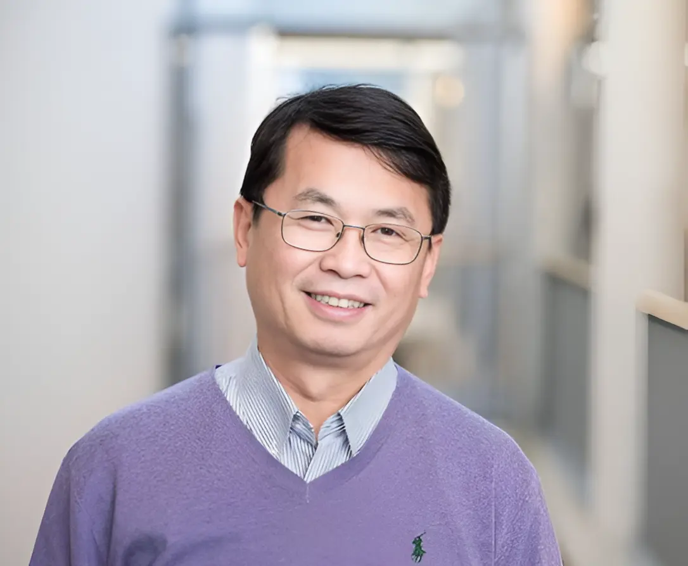

# Jinyue Yan: Energy Systems with High Renewable Penetration

Climate New Research

Climate and Energy

This lecture addressed the transition of clean energy systems and illustrated, by an example, how an optimization solution can be achieved under the condition of high renewable energy penetration.

Author

Climate Guest Speakers

Published

June 23, 2017

## Title

Jinyue Yan: Energy Systems with High Renewable Penetration

### Time

June 23, 2017

11AM - 12PM ET

### Venue

1310 Old Computer Science

Stony Brook University

## About

Energy, or precisely, “Clean Energy”, is at the centre of a highly active and dynamic field, which changes and affects not only our current life, but also our near future. Due to the importance Clean Energy currently possesses and its transitive characteristics: research, development, implementation, innovation, market penetration of clean energy technologies and systems have expanded in recent course of time. Energy systems have been in transition, extending their boundaries beyond the energy systems themselves. One of the challenging issues is the intermittent power generation and mismatching of energy supply and demand over a time scale when high renewable energy penetration takes place.

This calls for a new way to solve the challenging issues associated with new transitions of future clean energy systems with interdisciplinary and synthetic approach from not only the systematic overview, but also detailed components of clean energy systems. It needs to integrate the end-users load control with different energy saving approaches. It is location specific and highly tailored to serve its customers’ needs. This lecture addressed the transition of clean energy systems and illustrated, by an example, how an optimization solution can be achieved under the condition of high renewable energy penetration.

## Speaker

##### Dr. Jinyue Yan

Professor, Mälardalen University

### Bio

Dr. J. Yan is Chair Professor of Energy Engineering at Mälardalen University& Royal Institute of Technology, Sweden. He is director of Future Energy Profile. Prof. Yan’s research interests include advanced energy systems; renewable energy; advanced power generation; climate change mitigation technologies and related environment and policy; CDM etc. Prof. Yan published about 300 papers including in Science & Nature Climate Change. Prof. Yan is editor-in-chief of Applied Energy journal & editor-in-chief of Handbook of Clean Energy Systems. He is the Chair of International Conferences on Applied Energy. He also serves as the advisory expert to the UN, EU, & ADB etc. He is the academician of European Academy of Science and Arts.
