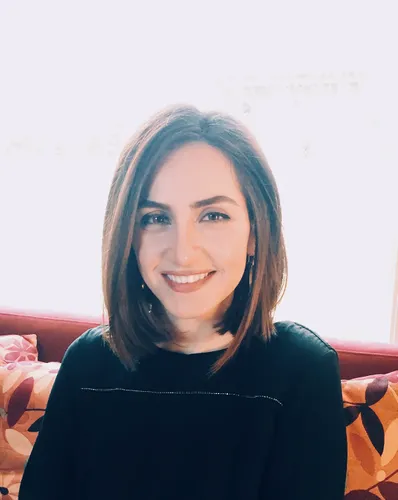

# Maryam Mozafari: From Fossil Fuels to Future Fuels — A Journey from the Oilrigs to Climate Policy

Climate and Career

Maryam will talk about her own experience transitioning from the oil & gas industry to impactful large-scale clean energy policy.

Author

Climate Guest Speakers

Published

October 15, 2024

## Title

Maryam Mozafari: From Fossil Fuels to Future Fuels — A Journey from the Oilrigs to Climate Policy

### Time

October 15, 2024

6:00PM - 7:00PM ET

### Venue

Online via zoom. Please [register](https://forms.gle/65hnhJPmnYaz5utG9) to participate.

## About

This talk captures Maryam’s career evolution from technical roles in traditional energy sectors to a focus on impactful, large-scale clean energy policy. It highlights personal growth, key turning points, and current role in shaping innovative energy solutions in California.

## Speaker

##### Maryam Mozafari

Program Supervisor, California Public Utilities Commission

### Bio

Maryam leads the Demand Response/Demand Flexibility section at the California Public Utilities Commission. Her team develops policies aimed at unlocking the potential of demand flexibility (from distribution level DR to CAISO wholesale integration to CalFUSE) and maximizing the utilization of Behind-the-Meter and Distributed Energy Resources. Maryam previously served as Senior Energy Advisor to Commissioner Darcie Houck where she worked on innovative strategies for the planning and operation of a high DER distribution grid. Whether a manager, an advisor, or an engineer on offshore oil platforms, Maryam aspires to make the world a better place, one step at a time. She holds a BSc in Mechanical Engineering and a MSc in Energy and Resources from UC Berkeley.
