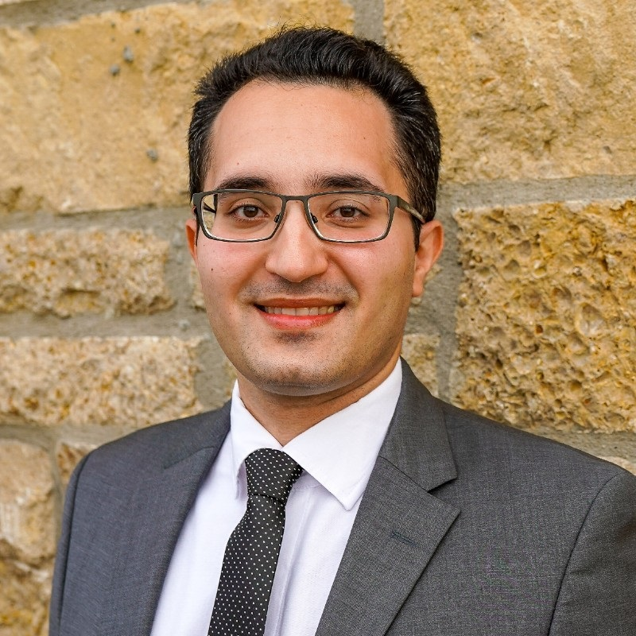

# Mohsen Fatemi: Passion, Profession, Progression

Climate and Community

Climate and Career

Mohsen will share his career experiences and research on including social equity in energy planning

Author

Climate Guest Speakers

Published

November 18, 2024

## Title

Passion, Profession, Progression

### Time

Monday, November 18, 2024

6:00PM - 7:00PM ET

### Venue

Online via Zoom. Please [register](https://forms.gle/65hnhJPmnYaz5utG9) to participate.

## About

I’m S. Mohsen Fatemi, a doctoral researcher in public administration with an interdisciplinary background in architecture, urban planning, and sustainability. My journey from designing energy-efficient buildings in Iran to advocating for energy justice in the U.S. illustrates how career paths can evolve in unexpected yet rewarding ways. My work now focuses on how local governments and investor-owned utilities can integrate energy justice into their operations. In my talk, I’ll share insights from my career transition, the challenges and motivations behind it, and my experiences on the Sustainability Advisory Board in Lawrence, Kansas. I’ll also discuss my ongoing research, which investigates the incorporation of social equity in energy planning. My story emphasizes the importance of interdisciplinary approaches, community engagement, and persistence in driving meaningful change in the field of energy and climate policy.

## Speaker

##### S. Mohsen Fatemi

PhD Candidate, University of Kansas

### Bio

Mohsen Fatemi is a doctoral candidate in the School of Public Affairs and Administration at the University of Kansas. His research centers on Energy and Environmental governance, policy, and justice. Additionally, as an urban planner and architect, he has experience in sustainability, climate action planning, and energy efficiency.

  
