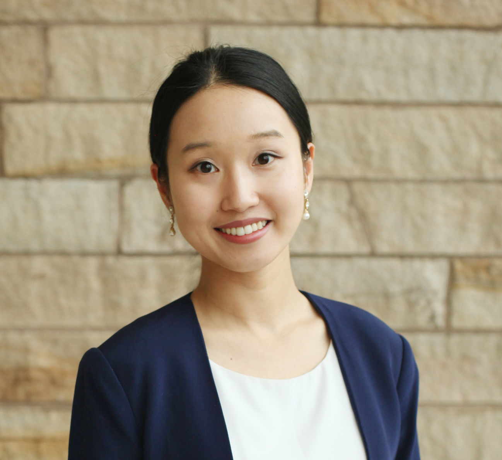

# Wei Peng: Making Climate Policy Models More Decision-relevant

Climate and Environment

Climate New Research

Climate and Energy

Three areas to make IAMs more decision-relevant

Author

Climate Guest Speakers

Published

April 13, 2023

## Title

Wei Peng: Making Climate Policy Models More Decision-relevant

### Time

April 13, 2023

11:30AM - 12:30PM ET

### Venue

Online via Zoom.

## About

Efforts to achieve decarbonization targets often fall short. Integrated assessment models (IAMs) have been used widely to assess current policies and quantify the additional efforts needed to close the gap. Yet, IAMs still lack adequate considerations of socio-political factors that are central to climate policy making. This makes them overly abstract and simplistic to inform concrete decisions by national and subnational policymakers. In this talk, I will discuss our research focused on three areas to make IAMs more decision-relevant: 1) enhancing policy realism by incorporating political economy insights on policy heterogeneity and instrument choice; 2) assessing winners and losers of climate policy by coupling IAMs with fine-scale impact assessment models; and 3) identifying equitable policy strategies by assessing multiple objectives under future uncertainties. I will demonstrate a range of modeling examples, from the cost of state-driven climate policy in the U.S. to the unintended health effects from a global carbon price.

## Speaker

##### Dr. Wei Peng

Assistant Professor, Penn State University

### Bio

Wei Peng is an assistant professor of international affairs and civil and environmental engineering, SIA’s first joint appointment faculty member with the College of Engineering. Peng’s research focuses on the environmental and socioeconomic impacts of energy policies in both emerging markets and advanced economies. Prior to her arrival at SIA, Peng was a Giorgio Ruffolo Postdoctoral Research Fellow at Harvard University’s Kennedy School of Government. Her research has been published in Proceedings of the National Academy of Sciences, Nature Energy, and Nature Sustainability, among others. She earned her Ph.D. in science, technology, and environmental policy from Princeton University and her B.S. in environmental science from Peking University. Visit her personal website to learn more.

## Readings

- Peng, Wei, Gokul Iyer, Matthew Binsted, Jennifer Marlon, Leon Clarke, James A. Edmonds, and David G. Victor. 2021. “The Surprisingly Inexpensive Cost of State-Driven Emission Control Strategies.” *Nature Climate Change*, August, 1–8. <https://doi.org/10.1038/s41558-021-01128-0>.

- Peng, Wei, Gokul Iyer, Valentina Bosetti, Vaibhav Chaturvedi, James Edmonds, Allen A. Fawcett, Stéphane Hallegatte, David G. Victor, Detlef van Vuuren, and John Weyant. 2021. “Climate Policy Models Need to Get Real about People — Here’s How.” *Nature* 594 (7862): 174–76. <https://doi.org/10.1038/d41586-021-01500-2>.

- Yang, Hui, Xinyuan Huang, Daniel M. Westervelt, Larry Horowitz, and Wei Peng. 2022. “Socio-Demographic Factors Shaping the Future Global Health Burden from Air Pollution.” *Nature Sustainability*, October, 1–11. <https://doi.org/10.1038/s41893-022-00976-8>.
