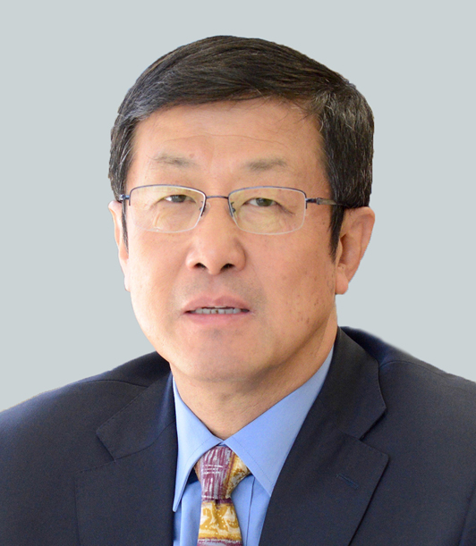

# Xiansheng Sun: Energy Trends—Transition and Challenges

Climate and Energy

Climate and Governance

Energy Trends—Transition and Challenges

Author

Climate Guest Speakers

Published

July 25, 2017

## Title

Xiansheng Sun: Energy Trends—Transition and Challenges

### Time

July 25, 2017

3PM - 4PM ET

### Venue

1441 Old Computer Science

Stony Brook University

## Speaker

##### Dr. Xiansheng Sun

Secretary General, International Energy Forum

### Bio

Dr. SUN Xiansheng took up the post as International Energy Forum (IEF) Secretary General on 1 August 2016. Prior to his election, Dr. Sun was the President of China National Petroleum Corporation’s (CNPC) Economics and Technology Research Institute (ETRI) where he leads a team of over 370 staff members. Reporting to the Chinese leadership on energy policy decision making, including energy security strategies, “3E” (Energy, Environment, Economy) program development, low-carbon energy mix optimization, “three steps” of Chinese gas pricing reforms, and international energy cooperation. Dr. Sun was deeply involved in the Chinese energy five-year planning process and many other major policies. Dr. Sun also served as chief editor of ETRI’s “Oil & Gas Industry Development Report” and the first “China Energy Data & Statistics” report. Dr. Sun holds an LLM and Ph.D. from the Centre for Energy, Petroleum and Mineral Law and Policy (CEPMLP), University of Dundee, UK.
