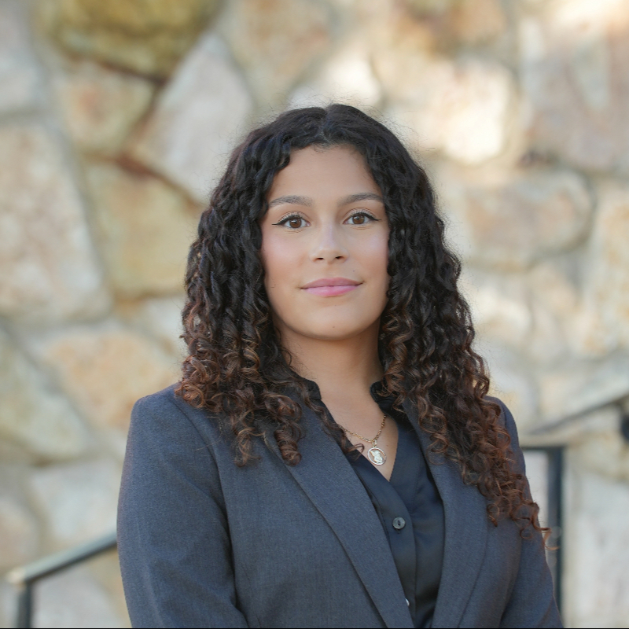
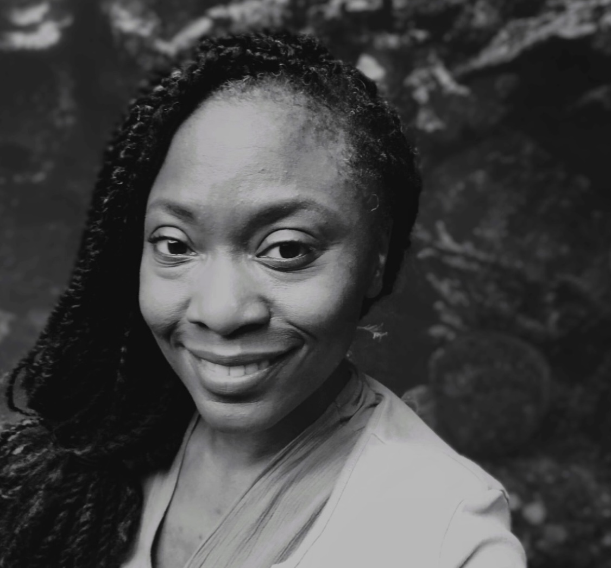

# Student Stories

Students whose potential we may spark, and who may spark something in us

##### Dayana Guerrero Uribe Earns John D. Solomon Fellowship for Public Service

Assigned to NYC Emergency Management in the Government Relations Unit, Uribe (MIA ’26, global security) aims to gain experience in navigating intergovernmental processes…

Sep 9, 2025

##### Abraham Lugo Selected for Inaugural Johnson Justice Fellowship

Abraham Lugo is seeking a professional and personal life dedicated to building a representative and equitable democracy where all people can live with dignity.

May 5, 2025

##### Catherine Davis Awarded Prestigious New York State Senate Legislative Fellowship

Catherine Davis (MPA ’24) is working for New York State Senator Jamaal T. Bailey as a legislative staffer.

Mar 24, 2025

##### Jacob Fain Advances Clean Energy Initiatives in Sea Cliff

Jacob Fain, Sea Cliff’s clean energy intern, pitched the Community Solar initiative, which enables residents, small businesses, and even municipal buildings to sign up for…

Feb 7, 2025

##### Nico Antonucci in the Student Spotlight

Nico Antonucci talks about his summer abroad in Amsterdam, his interest in environmental justice, and more.

Oct 15, 2024

##### LaDorian Morris Wins Excelsior Service Fellowship

LaDorian Morris (MPA ’24) is working with the Division of Homeland Security and Emergency Services, Office of Disaster Recovery in Albany.

Oct 10, 2024

##### Valerie Chlafer Wins Fellowship to Germany

Valerie Chlafer, a public affairs major and an aspiring Foreign Service Officer, is the fifth Baruch undergraduate to be chosen for U.S. State Department’s…

Apr 2, 2024

##### Andrew Rubenbauer

Andrew Rubenbauer completed a 12-week fellowship this summer with the Dairy Farmers of America in Kansas City working on projects that help farmers, the planet and climate…

Oct 25, 2023

##### Lindsey McCormack in the Student Spotlight

Lindsey McCormack talks about her work as Director of Development for Rights CoLab, her experience in the MIA program, and more.

Nov 15, 2022
