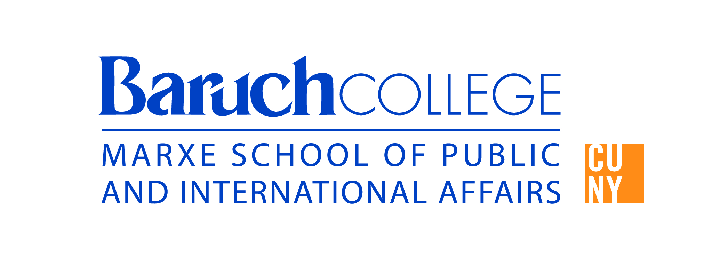

# Support

[Interested in Being a Guest Speaker](https://forms.gle/AD4pujkhQkGiUHT69) [Register to Participate](https://baruch.zoom.us/meeting/register/ZvRnp4MmTHSyn4DRzAr3sw) [Donate to Support Our Climate Students](https://www.cunytuesday.org/campaigns/the-marxe-school) [Get an MPA with a Climate Change Specialization](https://marxe.baruch.cuny.edu/homepage/academics/master-of-public-administration/)

## Resources

##### Marxe School of Public and International Affairs

Advancing Public Service Education

Our mission is to educate and empower leaders, advance knowledge about societies and policies, and engage diverse communities across New York City and the world to develop…
